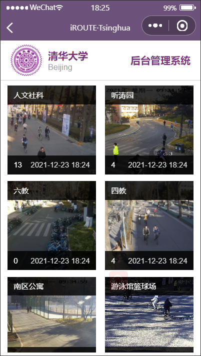

# TFMS

TFMS: Traffic Flow Monitoring System at Tsinghua

## Description

This repository contains code for TFMS, a WeChat mini program realizing real-time pedestrian and bicycle flow monitoring on Tsinghua campus arterial roads and providing users with route suggestions to avoid congestion.

The frontend is developed using WXML, WXSS and JavaScript, in a framework provided by WeChat with access to its APIs. WXML and WXSS are similar to HTML and CSS, but are specific to WeChat mini programs. The backend is developed using python, and it utilizes YOLOv5 algorithm to detect the traffic flow in campus surveillance videos.

## Demo

### Login and Authorization

    

When users login for the first time, they need to authorize with their WeChat account. There is also a special button for administrators to login.

### Main Interface

The navigation bar on the bottom of the page contains three tabs: navigation, query and information.

    
    

The navigation page initially shows the campus map and waits for users' further instructions to provide route suggestions. The start point of the navigation is automatically set to the current place of the user. The text box on the screen prompts the user to enter the destination. Then the app will color the suggested route on the map. If the route goes through some congestion zone, there will be a pop-up window warning the user.

    

On the query page, users can click on specific red marks on the map to check the traffic flow of places of interest.

    

The information page shows the most recent update of the traffic flow information on the whole campus as a list.

### Administrator

    
    
    

The administrator can check the real-time traffic flow and time of update of every monitoring points. He can also manually change the data to tackle emergency situations such as disconnection from backend server.
